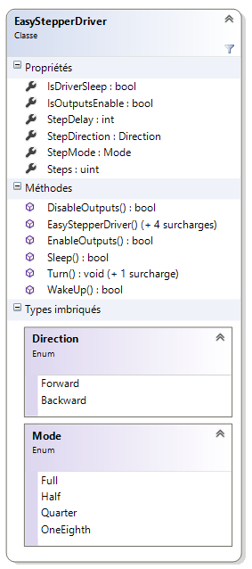
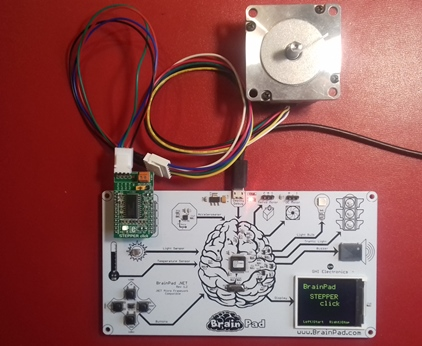

# EasyStepperDriver

<strong>Description</strong>
-------------------------------------
Source code.

A <strong>.NETMF v4.3 class</strong> write for a <strong>A3967 EasyDriver Shield Stepper Motor Driver Module</strong>. 

This class is also in the <a href="https://www.nuget.org/packages/WEBGE.Microtoolskit/" target="_blank">MicroToolsKit</a> <strong>library</strong>. Download at <a href="https://www.nuget.org" target="_blank">nuget.com</a>

 
 
<strong>Hardware</strong>
---------------------
<strong> Targets </strong>: Netduino, Netduino2 plus, Netduino 3, FEZ PANDA 3, COBRA 3 and BrainPad.

<strong>Software</strong>
---------------------
<ul>
<li><strong>Language</strong> : C#</li>
<li><strong>Framework used</strong> : .NETMF v4.3</li>
<li><strong>IDE</strong> : Visual Studio Community 2013 (2015)</li>
<li><strong>xml</strong> : documentation inside class </li> 
</ul>

<strong>Visual Studio solution</strong>
-------------------------------------
<ul>
<li><strong>EasyStepperDriver </strong>
<ul>
<li><strong>EasyStepperDriver</strong> : .NetMF class</li>

<li><strong>Netduino</strong> : class test program for Netduino board</li>
<li><strong>FezPanda</strong> : class test program for Fez Panda board</li>
<li><strong>BrainPad</strong> : class test program for BrainPad board</li>
<li><strong>BrainPadLibrary</strong> : class library for BrainPad board</li>
</ul>
</li>
</ul>

<strong>Assembly</strong>
--------------------------
<table>
<tr>
<td></td>
<td></td>
</tr>
</table>

<strong>Videos on Youtube</strong>
-------------------
<ul>
<li><a href="https://youtu.be/Kc1_DE5p3R0" target="_blank">BrainPad and STEPPER click</a></li>
<li><a href="https://youtu.be/K_PtVVJPNFo" target="_blank">Mechanical reduction</a></li>
<li><a href="https://youtu.be/l_M70CIIXU0" target="_blank">Ping pong ball thrower 1</a></li>
<li><a href="https://youtu.be/4_QfgJS_Ang" target="_blank">Ping pong ball thrower 2</a></li>
<li><a href="https://youtu.be/66fcVjNp61Q" target="_blank">Ping pong ball thrower 3</a></li>
</ul>

<strong>Keywords</strong>
----------------------------
GPIO, Netduino, FEZ, PANDA, COBRA, BrainPad, C#, NETMF, Visual Studio.

<strong>Tested on</strong>
-------------------
Fez Panda III, Netduino2 plus, BrainPad

<strong>To get started</strong>
--------------------
See <a href="http://webge.github.io/EasyStepperDriver/" target="_blank">EasyStepperDriver GitHub Page</a> (in French).

<strong>Wikis</strong>
--------------------
- <a href="https://csharpembarquenetduino.wikispaces.com/Home" target="_blank">Netduino et FEZ</a> (in French).
- <a href="https://csharpembarquebrainpad.wikispaces.com/Home" target="_blank">BrainPad</a> (in French).

<strong>News feeds on Google+</strong>
--------------------
- <a href="https://plus.google.com/collection/oaaJX" target="_blank">Netduino et FEZ</a> (in French).
- <a href="https://plus.google.com/collection/sEHQME" target="_blank">BrainPad</a> (in French).

<strong>Project site</strong>
--------------------
- <a href ="https://csharpembarquenetduino.wikispaces.com/6.+MicroToolsKit+library">MicroToolsKit library</a> (in English).

<strong>Maintened by</strong> <a href="mailto:philippemariano@gmail.com">WebGE</a>
